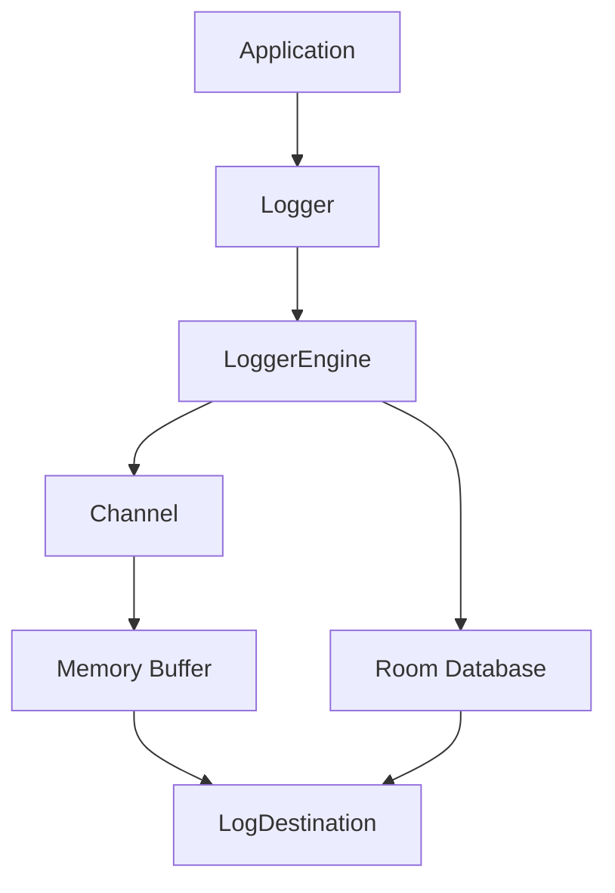

# Logger SDK

A lightweight, coroutine-based Android logging SDK built with **Kotlin Coroutines**, **Channel**, **Flow**, and **Room**.

Logger SDK provides reliable log collection with automatic batching, offline persistence, lifecycle awareness, and pluggable upload destinations while keeping the public API simple.


---

# Why Logger SDK?

Unlike a traditional logger, Logger SDK is designed for production-ready applications.

It automatically:

- Batch logs before uploading
- Stores logs offline using Room
- Uploads cached logs when internet returns
- Flushes logs on timeout or app background
- Supports any log model
- Uses Coroutines, Flow and Channel internally
- Allows custom upload implementations

---

# ✨ Features

- ✅ Coroutine based
- ✅ Channel driven architecture
- ✅ Batch logging
- ✅ Timeout based flush
- ✅ Offline Room storage
- ✅ Automatic synchronization when internet is available
- ✅ Lifecycle awareness
- ✅ Connectivity awareness
- ✅ Generic log model support
- ✅ Thread-safe architecture
- ✅ Easy to extend

---

# 📋 Requirements

- Minimum SDK: **24**
- Compile SDK: **37**
- Kotlin **2.0+**
- Kotlin Coroutines

---

# 🏗 Architecture



| Component | Responsibility |
|------------|----------------|
| Logger | Public SDK API |
| LoggerEngine | Core processing logic |
| Channel | Thread-safe event queue |
| Memory Buffer | Holds logs before upload |
| Room Database | Offline persistence |
| LogDestination | Upload destination |
| LifecycleObserver | Foreground / Background monitoring |
| ConnectivityObserver | Network state monitoring |

---

# 🚀 Logging Flow

```text
Logger.sendLog()
        │
        ▼
      Channel
        │
        ▼
 Memory Buffer
        │
        ├──────── Batch Size Reached?
        │
        ├── YES ─────────────► Upload
        │
        └── NO
              │
              ▼
        Timeout Reached?
              │
              ▼
            Upload
```

Logs remain in memory until one of the following occurs:

- Batch size is reached
- Timeout expires
- Logger.forceFlush() is called
- Application goes to background

---

# 📦 Offline Flow

```text
Internet Lost
      │
      ▼
Memory Buffer
      │
      ▼
Room Database
      │
      ▼
Internet Available
      │
      ▼
Read Logs
      │
      ▼
Upload
      │
      ▼
Delete Uploaded Logs
```

When internet becomes unavailable:

- Current memory buffer is moved into Room.
- New logs are directly stored in Room.
- Once internet becomes available again, stored logs are uploaded and deleted.

---

# 📥 Installation

## Step 1

Add the JitPack repository.

```kotlin
dependencyResolutionManagement {
    repositories {
        google()
        mavenCentral()
        maven("https://jitpack.io")
    }
}
```

---

## Step 2

Add the dependency.

```kotlin
implementation("com.github.Cntrk01:logger-sdk:1.0.0")
```

---

## Step 3

Initialize the SDK inside your `Application` class.

```kotlin
class App : Application() {

    override fun onCreate() {
        super.onCreate()

        Logger.initialize(
            application = this,
            config = SdkConfig(
                logDestination = ApiDestination()
            )
        )
    }
}
```

---

# 📝 Send Logs

```kotlin
Logger.sendLog(
    ScreenLog(
        screen = "Home"
    )
)
```

Force upload manually.

```kotlin
Logger.forceFlush()
```

Shutdown the logger.

```kotlin
Logger.shutDown()
```

---

# 🔌 Create Your Own Destination

The SDK does not impose how logs should be uploaded.

Simply implement your own destination.

```kotlin
class ApiDestination : LogDestination<ScreenLog> {

    override val serializer = ScreenLogSerializer()

    override suspend fun log(
        logs: List<ScreenLog>
    ) {

        // Upload logs to your backend

    }
}
```

Examples:

- REST API
- Firebase
- Kibana
- Ktor
- GraphQL
- Custom server

---

# 🔄 Serializer

Room stores logs as **String**.

A serializer converts your custom model into a String before saving it and restores it back when reading.

Example:

```kotlin
class ScreenLogSerializer : LogSerializer<ScreenLog> {

    override fun serialize(
        value: ScreenLog
    ): String {

        return Gson().toJson(value)

    }

    override fun deserialize(
        value: String
    ): ScreenLog {

        return Gson().fromJson(
            value,
            ScreenLog::class.java
        )

    }
}
```

Because of this mechanism, the SDK can persist **any model**.

---

# 🧩 Generic Model Support

Logger SDK is completely model-agnostic.

You can store any object.

```kotlin
data class ScreenLog(
    val screen: String
)
```

```kotlin
data class UserAction(
    val button: String
)
```

```kotlin
data class CrashReport(
    val stacktrace: String
)
```

As long as a matching `LogSerializer<T>` is provided, the SDK can persist and upload any custom model.

---

# ⚙ Configuration

```kotlin
SdkConfig(

    logDestination = ApiDestination(),

    batchSize = 20,

    timeoutMs = 30_000,

    channelCapacity = Channel.BUFFERED,

    maxOfflineFlushSize = 50,

    offlineSyncIntervalMs = 1_000

)
```

| Property | Default | Description |
|-----------|----------|-------------|
| batchSize | 20 | Upload after N logs |
| timeoutMs | 30000 | Flush timeout |
| channelCapacity | BUFFERED | Channel capacity |
| maxOfflineFlushSize | 50 | Offline upload batch size |
| offlineSyncIntervalMs | 1000 | Delay between offline batches |

---

# 🛣 Roadmap

## ✅ Current

- [x] Coroutine based engine
- [x] Channel architecture
- [x] Batch upload
- [x] Timeout flush
- [x] Offline Room storage
- [x] Connectivity observer
- [x] Lifecycle observer
- [x] Generic model support
- [x] Custom upload destinations

---

## 🚧 Upcoming

- [ ] Crash Logger
- [ ] Retry Policy
- [ ] Exponential Backoff
- [ ] Encryption
- [ ] File Logger
- [ ] Compression
- [ ] Interceptors
- [ ] Metrics API
- [ ] Firebase Destination
- [ ] Kibana Destination
- [ ] Ktor Destination
- [ ] Custom Retry Strategy

---

# 🤝 Contributing

Contributions, issues and feature requests are always welcome.

Feel free to open an Issue or submit a Pull Request.

---

# 📄 License

This project is licensed under the MIT License.

See the **LICENSE** file for more information.